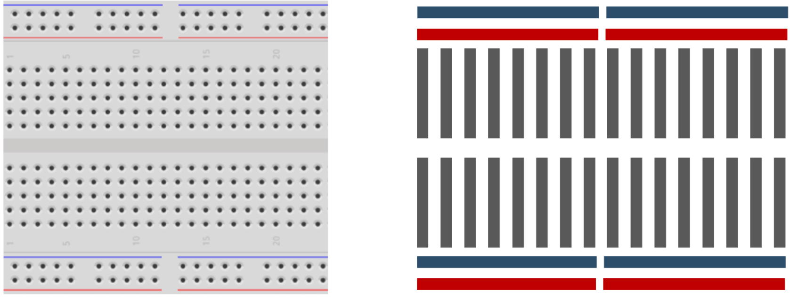

# Microprocessors
A microprocessor or microcontroller is a small computer designed to run one program.<br />
Unlike a computer it has the ability to interact with the world through **General Purpose Input Output (GPIO)** pins.<br />
The GPIO pins allow you to turn check or set a pins voltage. <br />

In this tutorial, we will be using an Arduino Nano. 
This microcontrollor is good as it has:
* A large amount of GPIO's both (analog and digital).
* It can run with a usb power supply from the computer.
* It uses the open source [Arduino IDE](https://www.arduino.cc/en/main/software) to program it.
* It fits inside a breadboard.


# Circuits
For making circuits, you will be using a breadboard (bellow). <br />
These boards allow you to insert components and connect them through its internal wiring. <br /> 
This wiring is shown in the image to the right (everything in a line is connected). <br /><br />



# Programming
To program the microcontroller, you will need the [Arduino IDE software](https://www.arduino.cc/en/main/software).

## How to code
A program is a list of commands in an order. <br />
A computer will excecute these commands line by line <br />
For instance consider how to blink a light. 
```
Turn the light on.
Wait
Turn the light off.
Wait
Go back to step 1.
```
The computer will read these in order and continue to loop blinking the light on and off.
The correct syntax in arduino is:
```cpp
/* 
	This is a comment block.
	Any text inside here will be ignored by the compiler.
*/

//  This is a comment, anything after a '//' will be ignored.

void setup() {
	pinMode(13, OUTPUT);    // Set pin 13 to output 5V.
}

void loop() {
	digitalWrite(13, HIGH); // Set pin 13 as an output.
	delay(1000);            // Wait 1000 ms (1 second).
	digitalWrite(13, LOW);  // Turn off pin 13.
	delay(1000);
}
```
In arduino you must have the 'functions':
* `void setup()`
	This will run **once** before `void loop()`
* `void loop()`
	This will repeat until the controller is unplugged.

`pinMode(pin, type);` will set a pin to either input or output.
`digitalWrite(pin, output);` will set a pin to 0 or 5V.
`delay(time);` will stop the program for the specified amount of time in milliseconds.

Every command must have a `;` at the end.
